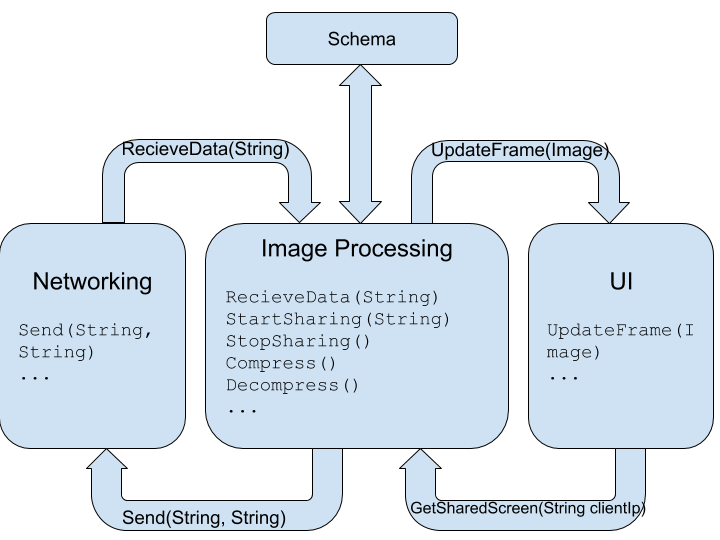
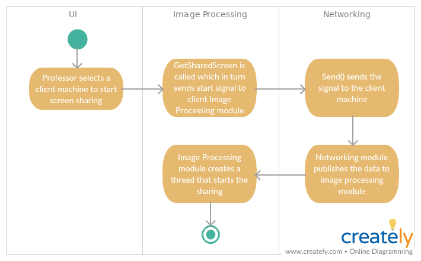
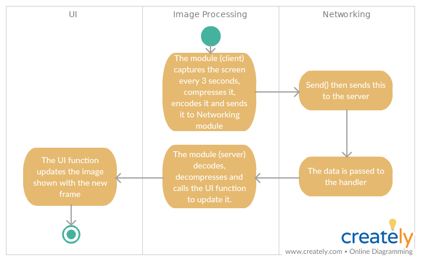

# ImageProcessing Team

The Image Processing Team develops the module that enables the clients to share their screen with the server.

## Members

|||
|--------------------|:--------------:|
| Amish Ranjan       | Code           |
| Axel James         | Design         |
| Ravindra Kumar     | Compression    |
| Sooraj Tom         | Team Lead      |
| SST Siddhardha     | Compression    |
| Suman Saurav Panda | Testing        |

## Objectives

1. Use Networking API & Schema API, send screen to the server IP after encoding it . (Client)
2. Use Networking API & Schema API, recieve screen data from client, decode it and publish it to UI. (Server)
3. Provide an API to start and stop the sharing from UI. The server sends signal for starting the screen  sharing.
4. Capture the screen from client and apply compression if possible.

## Dependencies 
The following components depend on this module.

* UI

This module depends on the following modules.

* Networking
* Schema

## Module Diagram


## Activity Diagram

#### Start sharing


#### Sharing


## Interface 
Interface given to the UI at the server side to start / stop screen sharing.  
```csharp
public interface IImageProcessing
{
	/// <summary>
	/// This method starts the screen sharing process.
	/// It is called by the server (professor) with the IP address of the client (student).
	/// </summary>
	/// <param name="clientIP">This parameter is the IP address of the target client computer</param>
	void GetSharedScreen(string clientIP);

	/// <summary>
	/// This method terminates the screen sharing session.
	/// </summary>
	void StopSharedScreen();
	
	/// <summary>
	/// This method registers the image updater for UI.
	/// </summary>
	public void RegisterImageUpdateHandler(ImageReceivedNotify imageReceivedNotifyHandler);
}
```

## Work Distribution

#### Amish Ranjan
- Compression and Decompression  
Decide on a compression scheme and implement it.
- Testing Compression

#### Axel James
- Signalling [Server & Client]  
Handling signals for starting / stopping sharing, resending, errors in server and client  
This function will subscribe to networking in both server and client.  
[Client]Signalling calls StartSharing, StopSharing, SendFullScreen(if diff is implemented)
[Server]Signalling calls RecieveScreenData, ConnectionError
- Test: Client functions 

#### Ravindra Kumar
- [Client] StartSharing  
Sends the screen data after compression in regular intervals.
- [Client] StopSharing  
Stops the screen sharing, deallocates resources.

#### Sooraj Tom (Team Lead)
- Design
- Review and Testing

#### SST Siddhardha
- [Server] GetSharedScreen  
Starts the process to get screen from a client. Calls the signalling fns, initialize threads and validates.
- API for persistence.  
API for giving a screenshot to the persistence module and retreiving image from persistence module.
- Test: Integration

#### Suman Saurav Panda
- [Server] RecieveScreenData  
Recieves screen data, calls decompression and publishes it to UI
- [Server] StopSharedScreen  
Stops the screen sharing. Sends signals, closes connection and destroys objects / threads.
- Test: Server functions

## Classes

- ImageProcessing:IImageProcessing
- Compression:ICompression
- ImageProcessingTest:ITest
