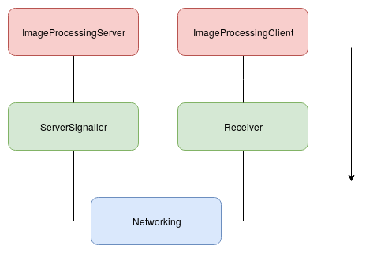

## Overview
#### Signalling
ImageProcessing module has different functions. But when the server wants something from client, it has to communicate that message to client and vice-versa. This is facilitated using some signalling mechanisms inside ImageProcessing module. A Publisher-subscriber model can be implemented in Client to facilitate this.
#### Testing client functions
Client has mainly two API's exposed to other modules:  
1. StartSharing  
2. StopSharing

Proper testing has to be done to ensure that these work as desired.

## Signalling
### Components
#### Datatype
```csharp
enum Signal
{
    Start, Stop, Resend
}
```
#### Interface
```csharp
public interface IServerSignalling
{
    void SignalClient(IPAddress toIP, Signal signalType);
}
```
#### Methods
- **SignalClient(IPAddress toIP, Signal signalType)**  
  This function is available at server side to signal the client. There can be three types of signals
    - _Start:_ To start sharing the screen. A packet would be send to the client side indicating the message, which would be processed by signal receiveing side in client.
  Expected caller: _**ImageProcessingServer.GetSharedScreen()**_
    - _Stop:_Signals the client to stop sharing the screen. A packet would be send to the client side indicating the message, which would be processed by signal receiveing side in client.
  Expected caller: _**ImageProcessingServer.StopSharedScreen()**_  
    - _Resend_: If the server wants to update it's reference image, then it can send a signal asking for resend which is processed by client's receiving function. This is needed in case of diff based compression techniques.
  Expected caller: ImageProcessingServer class
- **ReceiveSignal()**  
  This function subscribes to networking modules publisher and calls the Image Processing modules functions accordingly. It recives different kinds of signals and responds to it.
    - StartSharing: Calls ImageProcessingClient.StartSharing() which starts an asychronous thread and sends screenshots continuously.
    - StopSharing: Calls ImageProcessingClient.StopSharing() which stops any thread sending screenshots.
    - Resend: Calls API to resend the full image.
    - Image: Calls ImageProcessingServer.ReceiveImage() which takes data and displays in the UI.
  It also unpacks the message.


### Dependencies
#### Depends on
- Networking Module: For sending the signals
- Schema Module: For packing and unpacking the packet
#### Depended by
- Other classes in ImageProcessing Module



## Testing client functions
#### To test StartSharing
- Call the function and mark the delay between calling the function and between receiving each packet. Check if other parameters in packet such as screen size, full/partial image are correct.  
#### To test StopSharing
- Check what happens if StopSharing is called without StartSharing
- Check if the threads are destroyed after calling StopSharing


