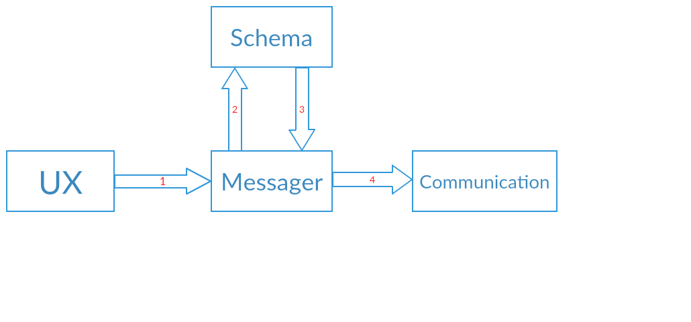

# Messaging
## Members
|||
|---------|---------------|
|Aryan Raj |Leader         |
|Gautam Kumar |Designer       |
|Vaka Sainishanth |Coder          |
|Rahul Dhawan |Coder          |
|Kawale Vishwajeet |Coder          |

## Objectives
* To provide an API to UX team so that they send message.
* To provide two API to UX team using which they can subscribe to events 
* To create eventHandler which will handle required events. 
* To Provide an API to retreive/store messages with specific parameters (date, time, sessionId etc.).
* To Give an API for deleting messages until a specific timestamp.

## Dependencies 
The following components depend on my module.

* UX ...We are providing SendMessage, SubscribeToDataReciever, SubscribeToStatusReceiver using interface IUxMessage.

My module depends on the following modules.

* **Schema**: For task encoding and decoding.
* **Persistence**: For the task storing,deleting and retrieving message.
* **Communication**:For the task sending message.

## Class Diagram


## Activity Diagram
* **Flow while sending message**



* **Flow while receiving message**


* **Flow with Persistence**


## Interface 
* The only interface We have, is IUxMessage
```csharp
Interface IUxMessage {
    void SendMessage(String message, String toIp,String toPort, String datetime);
    void SubscribeToDataReciever(DataRecieverHandler handler);
    void SubscribeToStatusReceiver(DataStatusHandler handler);
    void RetrieveMessage(fromTime,tillTime);
    void DeleteMessage( ip,fromTime,tillTime);
    void StoreMessage(message,fromIp,toIp);
    
}


* Handler Signature
public delegate void DataRecieverHandler(String message,String fromIp);
public delegate void DataStatusHandler(int status,Int messageId);


```
Consumed Interfaces:

* ICommunicate ()  ::This is iterface given by Communication team
* ISchema() :: This is the interface given by schema team
* IPersist()(Assumed name) :: This is the interface given be Persistence team


## Internal Components

### We have only one class Messager
* This class will implement IUxMessage
* In this class,we will make two callback function of signature given by Networking team
* Then In the class we will have two delegates as public member
* One ICommunicate object
* One ISchema type object
* one IPersist type object
* constructor:::In this we will instantiate ICommunicate object,ISchema object,IPersist object and Using ICommunicate subscriber function,we will subscribe our two callbacks

## PseudoCode
```csharp

   
Class Messager : IUxMessage
{
    
    public delegate void DataRecieverHandler(String message,String fromIp);
	
    public delegate void DataStatusHandler(int status,Int messageId);
   
    private ICommunicate comm;
    
    private DataRecieverHandler receiveHandler;
    
    private DataStatusHandler statusHandler;
    
    private ISchema schemaObj;
   
    private IPersist persistObj;
    
    public void StatusCallback(enum dataType,String messageId);
    
    public void DataCallback(String message,String Ipaddres);
    
    
    
    Messager()
    {
		//create an instance of ICommunicate and store in comm
		//similarly  schemObj,and persistObj then				
    }

    void SendMessage(String message, String toIp,String toPort, String datetime,messageId);
    {
    	//add time stamp to message and using schemaObj encode the message
    	//using ICommunicate send this encoded message to communication
    }
    public void SubscribeToDataReciever(DataRecieverHandler handler)
    {
    	//receiveHandler=new DataRecieverHandler(handler)
    	//pass our callback functions using subscriber functions of Communicator class
    }
    public void SubscribeToStatusReceiver(DataStatusHandler handler)
    {
    	//statusHandler=new DataStatusHandler(handler)
    	//pass our callback functions using subscriber functions of Communicator class	
    }
    void RetrieveMessage(fromTime,tillTime);
    void DeleteMessage( ip,fromTime,tillTime);
    void StoreMessage(message,fromIp,toIp);
    

 }
```


## Work Distribution
|||
|---------|---------------|
|Vishwajeet Kawale | Interaction with Persistence |
|Vaka Sai Nishanth | Interaction with Ux |
|Aryan Raj	       | Reviewer |
|Gautam Kumar      | Testcase design |
|Rahul Dhawan      | Constructor and callbacks|

