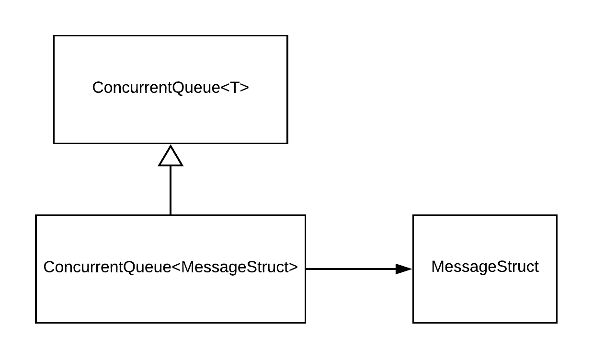

# MASTI Communication module

# Queue Management

Author: Jude K Anil \(111501011\)

# Introduction

The communications module requires a data structure for the receival and storage of messages handled by it. The data structure must provide functionalities for storing and retrieving messages in a FIFO manner. A Queue is a natural choice for such requirements. 

The Queue will be implemented as a class in a thread safe manner. There are two implicit parts to this documentation. The first deals with constructing a **Generic**, **Thread-Safe** class for a queue (First-in First-out) data structure and its related functionalities. The second part deals with constructing a Message structure which can serve as a concrete type for the queue class defined in the first.

# Relation to Other Components

The queues and message structure are internal to the communications module and are not exposed to any other module.

Within the communications module, it is used as a buffer for the data given by other modules. It is also used to store data received from other machines over the network while they wait for the subscribed module to receive them. The components that directly interact with queues are **Data-Outgoing** and the **Interface**.

# Design Choices

## Class

The queue class will be implemented in a type agnostic manner. This helps with code debugging, extension and general maintenance. The use of a Singleton pattern for the communication module necessitates the need for concurrency control mechanisms (monitors,  semaphores etc) to avoid multiple instantiations and/or non-deterministic queue states. Hence the queue must also have thread-safe properties to avoid inconsistencies. This generic safe implementation of the class is done by using the inbuilt ConcurrentQueue<T> class in C#. It has all the standard queue operations enqeue, deqeue, clear, in addition to other convenience functions. Using the inbuilt class over making one of our own offers better guarantees about the reliability of the functionality of the queue.

## Structure

The structure Message will contain the data given by  the Messaging/Imaging modules along with some metadata. The fields of the structure are
1. Data: The main data received from the Messaging/Imaging modules.
2. Data ID: A unique identifier for the Message object.
3. Target IP-address: The IP-address to which the message is to be sent. There is inbuilt support for ip-address values in C#.
4. Data Type: A tag specifying whether the data type (text, image etc).

# Code Outlay

```csharp
public enum DataType {Message, ImageSharing};

struct AppropriateName
{
	public string data;
 	public ulong dataID;
 	public IPAddress targetIpAddress;
 	public DataType type;
};

public static ConcurrentQueue<AppropriateName> recieveQueue = new ConcurrentQueue<AppropriateName>();
```
# Class Diagram



# Code Style

* The variable names are in camelCase.
* The function names are in PascalCase.
* The class names are in Pascalcase.
* The structure names are in PascalCase.
* The tab width used is 4 spaces.


