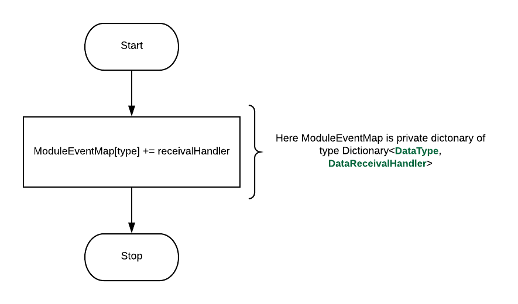
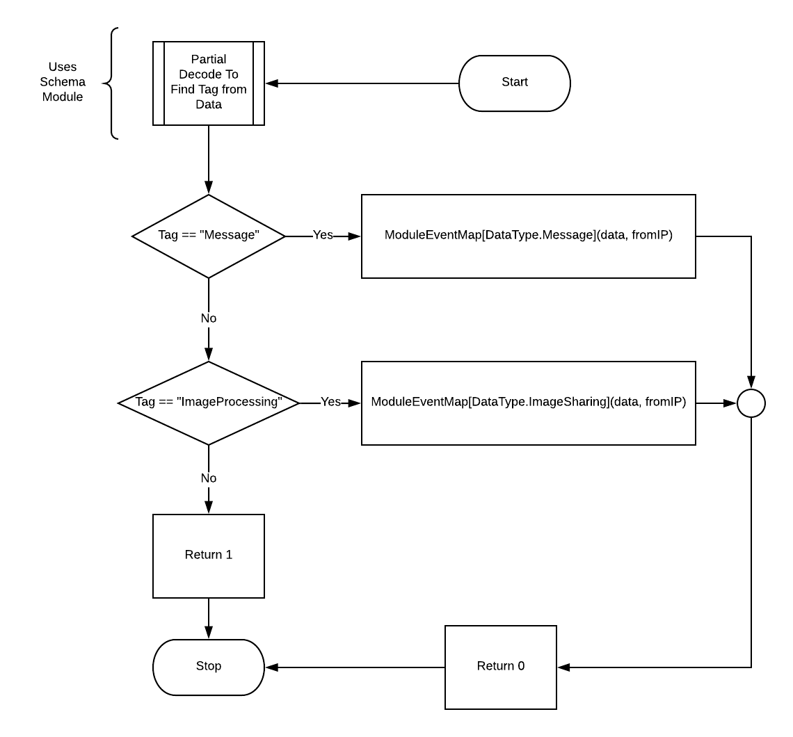

# MASTI Communication module

# Data receival notifier Component

Developer: Libin N George \(111501015\)

# Introduction

As communication module makes use of singleton pattern it has to listen to some fixed port and notify the either of the messaging module or Image processing module based on the data it receives. Thus, a function having a specific signature must be called when we receive some data. This function is provided by Messaging module and Image processing module is passed down to Communication module by subscribing to receive data using the function _SubscribeForDataReceival_ specified in the _ICommunication Interface_. This function is responsible for registering the Listener for a specific event. Data Receival Notifier Component is responsible for creating a particular event when we receive some data through _Data Incoming component_. This event is registered for receiving data corresponding to each module through Subscription. Thus, this component will implement the **Publisher** part of the **Publisher Subscriber design Patten**.

# Functional Dependency

## Dependency

- Uses **Schema Module** for finding the tag in the received message.

## Exposed To

- Both **Messaging Module** and **Image Processing module** will be using **SubscribeForDataReceival** through **ICommunication** Interface to subscribe(listen) for receiving data from another machine.
- **Data Incoming component of Communication module** will be using one internal function for processing and triggering the required event.

# Component Signatures

## Data Types used in Function Signatures
```csharp
enum DataType
{
    Message,
    ImageSharing
}
```
IPAddress is a type which is available in System.Net
## Event Handlers
```csharp
public delegate void DataReceivalHandler ( string  data, IPAddress fromIP);
```
## Function Signatures
```csharp
void subscribeForDataReceival ( DataType type, DataReceivalHandler receivalHandler );
int dataReceiveNotifier (string  data, IPAddress fromIP);
```
# Individual Component Parts Description
## Data Structures used in the functions
```csharp
Dictionary<DataType, DataReceivalHandler> moduleEventMap = new Dictionary<DataType, DataReceivalHandler>();
```
## DataReceivalHandler -> Event Handler
```csharp
public delegate void DataReceivalHandler ( string  data,  IPAddress fromIP);
```
**DataReceivalHandler** is an Event handler (deligate or function) which is triggered when the corresponding event occurs.  This Event handler is defined by messaging/image processing module as some function and should do everything that should be done when the corresponding module receives a message or data. The signature of this delegate function must have a return type void and string as first parameter (data received) and IPAddress as second parameter (from address).

## SubscribeForDataReceival -> Function
```csharp
void subscribeForDataReceival ( DataType type, DataReceivalHandler receivalHandler);
```
**SubscribeForDataReceival** is a function which register each module (listener) using event handler **DataReceivalHandler**. The module is identified based on **DataType** enum. This function must be thread safe as this function can be called from two modules, Messaging and ImageProcessing (each running in different threads).



## DataReceiveNotifier  ->  Function
```csharp
int dataReceiveNotifier (string data, IPAddress fromIP);
```
**DataReceiveNotifier** is a private function used by **Data Incoming or receiving component** inside Communicator class. This function triggers the event handlers based on the tag it finds using **Schema module's** (partial) decode function. This function returns 0 if it found the valid tag, otherwise returns -1.



# Notes On Component Unit Testing

- For unit testing sample delegate function ( **DataReceivalHandler** ) should be created.
- The event handler thus created should be used to subscribe using **SubscribeForDataReceival** function.
- Check that **DataReceiveNotifier** function triggers correct event handlers ( **DataReceivalHandler** )
- Tests should include different cases 
	- different subscribing module (different DataType)
	- data with different tags 
	- invalid tag (should not raise exception)
	
---------------------------------------------------------------------

written by Libin N George \(111501015\)
