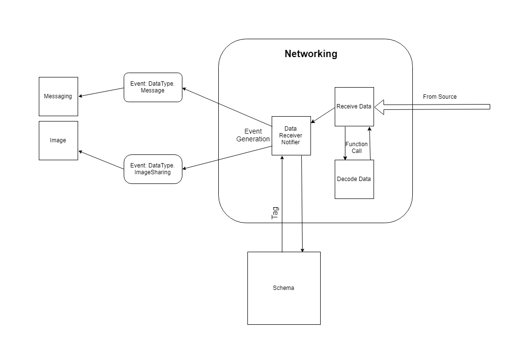

# MASTI Communication module

# Data Incoming Component

Developer: Rajat Sharma \(111501024\)

# Introduction

As communication module make use of singleton pattern it has to listen to some fixed port and notify the either of the messaging module or Image processing module based on the data it receives. Data incoming Component collect Data from socket, decode it ,and pass Data and IP to Data Receiver Notifier Component which then create particular event based on **Tag** in Data.

# Functional Dependency

## Dependency
Data outgoing componnent won't have any relations to modules other than communication i.e all relations would be internal. It depends on [Data Receiver Notifier](111501015Libin.md) Component to notify the data receival using its method **DataReceiverNotifier**. It is related to the Data Outgoing Module intimately as it needs to decide on encoding scheme for message with Data Outgoing Module so correctly identify end of message.

# Component Signatures

## Function Signatures
- This Function is used to decode the bytes data into string and to decide whether the packet is last or not.

    ```
        string DecodeData (bytes encodedData);
    ```
    
- This function will run in a seperate thread to receive data from socket

    ```
        void ReceiveData ();
    ```
    
- This function is provided by Data Receiver Notifier Component

    ```
        int DataReceiveNotifier (string  data, IPAddress fromIP);
    ```

# Design
- Transport Protocol

    ```
        We will be using sockets(TCP/UDP) instead of RPC.
    ```
    
    + Messages can't handle any packet loss so we need TCP for it.
    + [ImageProcessing Team](.../../../../ImageProcessing/Specs) also can't handle any loss thus we need TCP for it.
    
- Decoding Scheme 

    ```
        Various Encoding Schemes can be:
    ```
    
    + Appending length of data at the start of data.
    + Appending Delimiter at the end of data.
    + Reserving first bit of data , if it is 1 then it is the end part of data ,and if it is 0 then it is not.
    
    ```
        Based on their performance one of the above method will be choosen to encode and decode. 
    ```
    
## Workflow



- Data Incoming Module Keep listening and Collecting Data from Socket.
- Decode the data to find last part of data and to convert bytes data into string.
- Pass (Data, IPAddress) to Data Receiver Notifier Component.

# Code Style

* The variable names are in camelCase.
* The function names are in PascalCase.
* The class names are in Pascalcase.
* The structure names are in PascalCase.
* The tab width used is 4 spaces.

# Notes On Component Unit Testing

- All tests would be automated.
- Encode and Decode would be checked on local machine.
- A basic module testing would be done using loopback.
- Non-loopback testing of the module (testing over lan) and product testing related to this component shall be done [here.](111501026Rohith.md)

