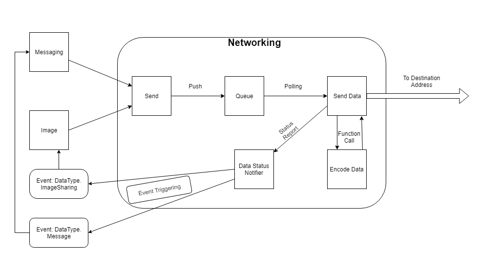

#MASTI Communication module


## Data Outgoing Component 
---
Developer: Ayush Mittal \([111501035](mailto:111501035@mail.com)\)  
`` `` `` `` `` `` `` `` `` `` `` ``  `` `` `` `` `` ``           [29ayush@gmail.com](mailto:29ayush@mail.com)
## Introduction

Communication module will use a queue mechanism to store the messages received from caller modules([Read Here](111501011Jude.md)).
The queue component stores the messages as strings, i.e as received from caller modules(untampered).
The job of this component would include:-


- Decide upon an encoding scheme with receiving component([Read Here](111501024Rajat.md)).
- Keep checking queue's IsEmpty Property by polling.
- If queue has a message, send it to its designation.
- Error Handling :- Check for invalid ip, if first sent fail retry some more times.
- Once the message is successfully sent or all attempts have been made to send it.
- Report the status to the sender module using [Data Staus Notifier](111501033Athul.md)

## Relation to Other Components
Data outgoing component won't have any relations to modules other than communication i.e all relations would be internal.
It depends on the [Queue Management](111501011Jude.md) component for fetching the messages. It depends on the [Data Status Notifier](111501033Athul.md) as it needs to report the success and failure status of the messages to the sender components. It is related to the Data Incoming Module intimately as it needs to encode messages in such a way so that the other end can understand when the message is over.

## Component Signatures

- ### Data Types used in Function Signatures

    1. Format of data received from queue
    
                struct AppropriateName
                {  
                    public string data;
                    public IPAddress targetIpAddress; // available in System.Net
                    ...    
                };

    2. Datatype to indicate status of the packet
    
                enum StatusCode
                {
                Success,
                Failure
                } 
    
- ### Function Signatures 

    3. This function is provided by the Data Status Notifier Component

        ```
        void DataStatusNotify(string message, StatusCode status);
        ```

    4. This function will run in a seperate thread created by the main function and when there is data to be send it will.
        It will use polling to check if there's data to be sent in the queue.
    
        ```
            public void SendFromQueue()
        ```

    5. This function will be used to encode the message into bytes

        ```
            public bytes EncodeData(string msg)          
        ```
    
## Design

- Transport Protocol

    ```
        We will be using sockets(TCP/UDP) instead of rpc.
    ```
    
    + Messages can't handle any packet loss so we need TCP for it.
    + [ImageProcessing Team](.../../../../ImageProcessing) also can't handle any loss thus we need TCP for it.
    
- Encoding Scheme 

    ```
        We have following three schemes in mind, based on performance metric estimate we would choose one later
    ```
    
    + Appending length of data at the start of data.
    + Appending Delimiter(Some Ending Pattern) at the end of data.
    + Reserving first bit of data , the last corresponding to message would have the reserved bit 1 while rest will have 0.
    
- Number of Retries  
    + If a message failed to deliver, we will attempt to resend it 7 more times.

## Workflow



- [ImageProcessing](../../../../ImageProcessing) and [Messaging](../../../../MessagingTeam) will use the **send()** function defined in the interface to push the data into the queue.
- SendData function keeps polling queue to check for data and now it has data, it calls the EncodeData function and then sends it.
- After the Data Outgoing component attempts to send a packet, the success or failure of the operation denoted by the datatype **StatusCode** is sent to the **DataStatusNotifier** through **DataStatusNotify** function along with the ID and origin module of the packet.

## Code Style

* The variable names are in camelCase.
* The function names are in PascalCase.
* The class names are in Pascalcase.
* The structure names are in PascalCase.
* The tab width used is 4 spaces.

## Notes On Component Unit Testing

- All tests would be automated.
- Encode and Decode would be checked on local machine.
- A basic module testing would be done using loopback.
- Non-loopback testing of the module (testing over lan) and product testing related to this component shall be done using [Test Cases here.](111501026Rohith.md)
