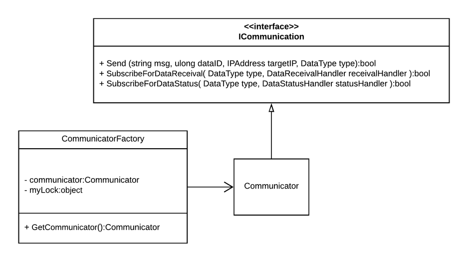
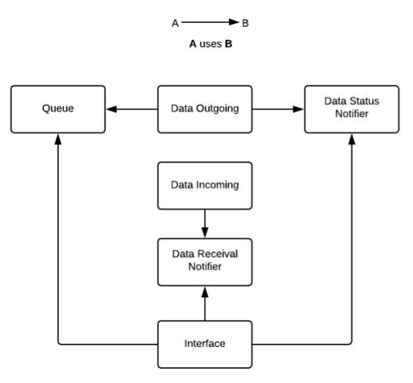
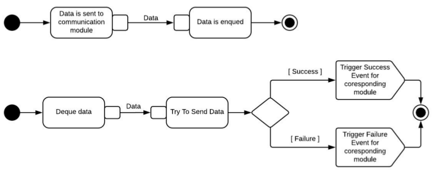
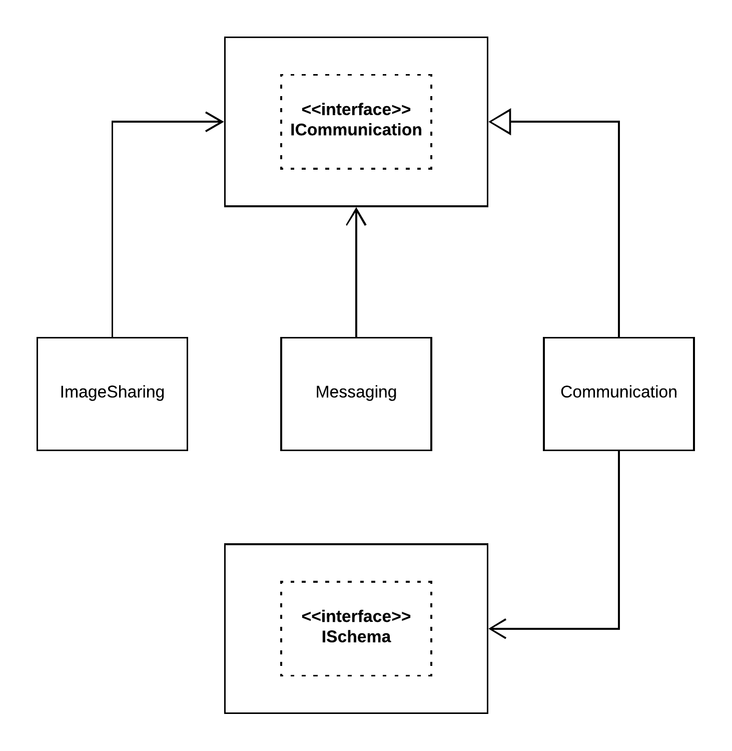

# Communication module
---

## Members

|||
|---------|---------------|
|Patel Parth Pragneshkumar |Leader         |
|Ayush Mittal |Coder       |
|Rajat Sharma |Coder          |
|Libin N George |Coder       |
|Athul M A |Coder          |
|Jude K Anil | Coder       |
|Rohith Reddy G | Quality Assurance Manager |

## Objectives
---
* To provide an API for Transmission and Receival of data

## Interface
---

- #### CommunicatorFactory Class \(Singletone Factory Class\)
    - `GetCommunicator` method will return a instance of class `Communicator` that implements `ICommunication` interface. 
    
- #### ICommunication Interface
```csharp
    public interface ICommunication () 
    {
        bool Send ( string msg, ulong dataID, IPAddress targetIP, DataType type );
        bool SubscribeForDataReceival ( DataType type, DataReceivalHandler receivalHandler );
        bool SubscribeForDataStatus ( DataType type, DataStatusHandler statusHandler );
    }
```
- #### Custom datatypes
    - DataType
        ```
        enum DataType 
        { 
            Message, 
            ImageSharing 
        }
        ```
    - StatusCode
        ```
        enum StatusCode 
        { 
            Success,
            Failure
        }
        ```
- #### Handler Signature
    - DataReceivalHandler
        ```
        public delegate void DataReceivalHandler ( string data, IPAddress fromIP );
        ```
    - DataStatusHandler
        ```
        public delegate void DataStatusHandler ( ulong dataID, StatusCode status );
        ```
- 
    
## Design
---

1. Communication module in **different thread**
    - On the first call of `GetCommunicator` method of `CommunicatorFactory`, required threads will be initialised.
2. Using Singletone Factory Pattern to provide our API. `CommunicatorFactory` implements this pattern to return instance of `Commuicator` class.
3. **Publisher-Subscriber pattern** to receive incoming data
    - Publisher : *Data Receival Notifier* component
    - Subscriber : Other Modules
    - Available Events
        - `DataType.Message`
        - `DataType.ImageSharing`
4. **Publisher-Subscriber pattern** to receive status of sent data
    - Publisher : *Data Status Notifier* component
    - Subscriber : Other Modules
    - Available Events
        - `DataType.Message`
        - `DataType.ImageSharing`
5. Uses schema API to find out tag of a message to trigger an corresponding event.
6. Using **TCP/IPV4** Sockets
    - Reason
        - TCP guarantee transfer of data & we can't afford lose of messages.
        - TCP gurantee inorder data receival, which is useful for to mantain the order of sent messages intact.
7. Internally we are using a single queue that contains data transmission requests coming from any upper layer module. Enque and Deque operations are protected using *lock* for **mutual-exclusion**.

## Components
---
1. ### **Queue management** (*Jude K Anil*)
    - Single queue that will contain all requests for Data transmission
    - Queue is safe for Concurrent access.
    - Queue entry contains
        - Data
        - DataID
        - Target IPAdress
        - DataType
2. ### **Data Outgoing** (*Ayush Mittal*)
    - Component handles all the request for data transmission.
    - If queue is not empty, it takes top request and send it to asked IP address.
    - On `Success` | `Failure` it talks to Data Status Notifier Component
3. ### **Data Incoming** (*Rajat Sharma*)
    - Components receives all the messages | Image coming from other device, convert to string, and pass to *Data Receival Notifier*.
    - Collect data from socket and pass data + IP to Data Receival Notifier Component
4. ### **Data Status Notifier** (*Athul M A*)
    - Based on request from *Date Outgoing* component, this component generates data status events. Currently supprts `Success` | `Failure` events.
5. ### **Data Receival Notifier** (*Libin N George*)
    - It's a Publisher which notifies subsriber when Data is received.
    - Uses Schema API to extract tag from Data received.
    - If tag is valid then it generates corresponding `DataType` receival Event else discard data
6. ### **Interface** (*Parth Patel*)
    - Implements `ICommunicate` interface in `Communicator` class.
    - Creates a singlton factory class (`CommunicatorFactory`) which has public method `GetCommunicator`, which returns instance of `Communicator` class.
7. ### **Test Cases** (*Rohith Reddy*)
    - Decides test-scenarios
    - Creates test cases that implement interface provided by Test Harness.



    
## Activity Diagram
---
- Receiving Data

    
    
- Sending Data

    

## External Dependencies
---
- Schema Module : To find tag associated with a received message

## Exposed To
---
- Messaging Module
- Image Processing Module


