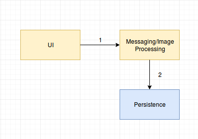
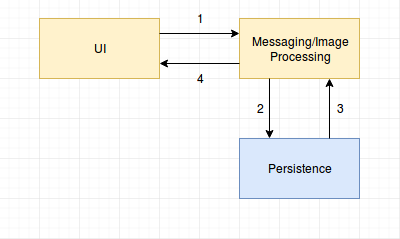
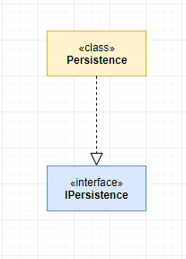
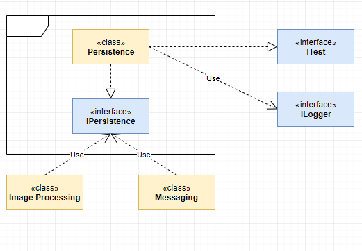

# Persistence Team

## Members
1. Prabal Vashisht (Leader/Designer/Coder)


## Objectives
* Provide an API to Server machine for storing/retrieving chat history.
* Provide an API to Server machine for archiving chat messages in a file.
## Dependencies 
The following components depend on my module. 

* Messaging module
* Image Processing module


My module depends on no module.

## Activity flow



FIG. When the user stops recording message, all the recorded message from UI gets dumped to the database (activity flows in accordance to the numbering).



FIG. When the UI wants to show the past messages, it retrieves it from the database (activity flows in accordance to the numbering).

## Class Diagram


FIG. Class diagram

## Module Diagram



FIG. Module diagram

##Design decisions

* **MongoDB Vs MySQL:** For storing data on disk, the team has voted on to using MongoDB since it is faster if there are less relationships between entities, if compared to MySQL.

* **Automatically recording Vs Specifying when to record:** In one session, the user can specify when to start recording the message (i.e. storing permanently) and when to stop (i.e. it won't be stored permanently). There will be a toggle button on the UI for this purpose.

* **Deletion of data:** The Persistence API will provide a method to the Messaging team to delete the old data from the database.


## Interface 

Persistence
```csharp
public interface IPersistence
{
	void Store (List<Dictionary>);
	List<Dictionary> Retrieve (String uname, DateTime startTime, DateTime endTime);
	void Delete (DateTime lastTime);
	void Archive (String filePath, String uname, DateTime startTime, DateTime endTime);
}

```
## Work Distribution
One member team, hence Prabal Vashisht will be accomplishing the required tasks.
