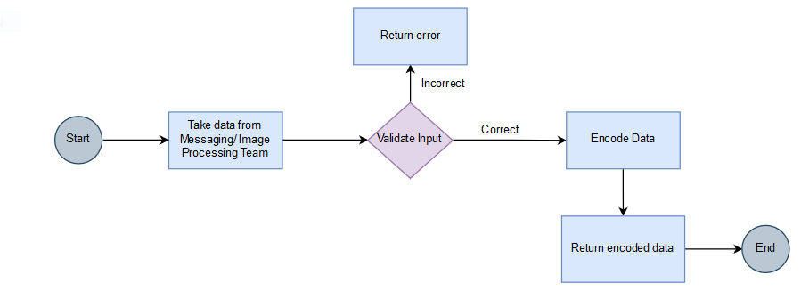
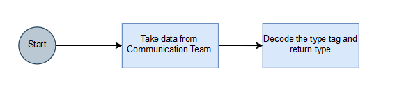
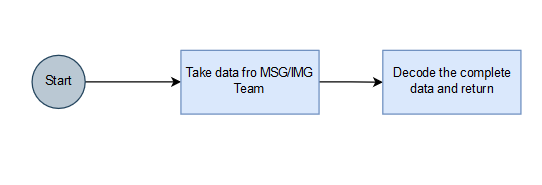
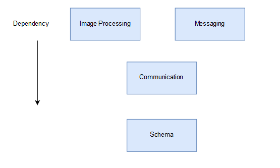
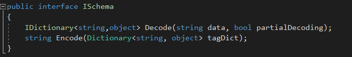

---
# Schema Team Report (PSE Project) ###
...

Team Members 
============

1.  Akshat Choube (Team Leader)

2.  Harsh Yadav (Developer)

3.  Vishal Kumar (Developer)

Task 
====

Schema team is responsible for data exchange that is the process of
taking data structured under a source schema and transforming it into
data structured under a target schema, so that the target data is an
accurate representation of the source data. Data exchange allows data to
be shared between different computer programs or systems.

Activity Diagram 
================

1.  Messaging/Image Processing ==> Schema ==> Messaging/Image
    Processing

    

2.  Communication ==> Schema ==> Communication

    

3.  IMG/MSG Team ==> Schema ==> IMG/MSG Team

    

Dependencies 
============

1.  Communication module depends on Schema to get type(IMG/MSG) of data
    received from other computer(Partial Decoding). Communication team can use any class for partial decoding. Partial encoding will return a 
    dictionary with single key-value pair where key is "type" and value can be "ImageProcessing" or "Messaging".

2.  Image Processing Module and Messaging Module depend on Schema for
    full decoding.

UML
====

Interface 
=========

Design Decision 
===============

**JSON VS XML**

We plan to consider JSON for this project because

1.  JSON is less verbose and parsing overhead is less.

2.  JSON is faster. (Source:- JSON vs XML: A Comparative Performance
    Analysis of Data Exchange Formats by Saurabh Zunke et al.)

3.  JSON data models structure matches the data.

**Choosing Separate Classes for decode/encode function of Images and
Messages**

Doing this allows us to keep some schema checks or tags specific to
images or messages.

Tentative Distribution of Work Load 
===================================

**Akshat Choube :**

-   Managing team and directing the efforts of team members towards
    completion of the module.

-   Ensure clean and well formatted code from developers.

-   Building Test cases.

**Harsh Yadav:**

-   Create a Class for Messages which implements ISchema Interface.

-   This involves writing encode/decode functions for the same.

**Vishal Kumar :**

-   Create a Class for Images which implements ISchema Interface.

-   This involves writing encode/decode functions for the same. 